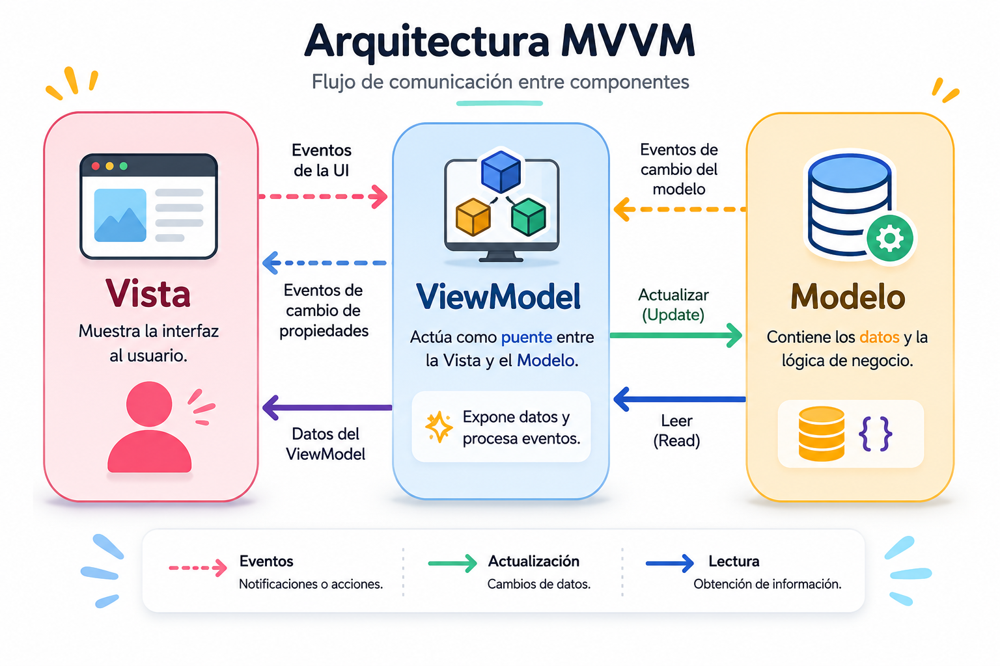

## Arquitectura MVVM Model-View-View-Model

## 1. Definición y Concepto

El **Model-View-ViewModel (MVVM)** es un patrón de arquitectura de software diseñado para separar estrictamente la capa de presentación (la interfaz de usuario) de la lógica de negocio y los datos de la aplicación. Esta separación de responsabilidades (Separation of Concerns) permite que los desarrolladores se enfoquen en la lógica del sistema mientras los diseñadores de UI trabajan en la presentación, sin interferir entre sí.

El patrón se compone de tres piezas fundamentales:

- **Model (Modelo):** Representa los datos, el estado y la lógica de negocio de la aplicación. Es responsable de gestionar la información (por ejemplo, comunicarse con una base de datos o una API) y garantizar las reglas de negocio. No sabe absolutamente nada sobre cómo se muestran los datos.
- **View (Vista):** Es la interfaz de usuario (UI). Su única responsabilidad es mostrar la información al usuario y capturar sus interacciones (clics, entradas de texto). La Vista en MVVM es "pasiva"; no contiene lógica de negocio, solo lógica de presentación visual.
- **ViewModel (Modelo de Vista):** Actúa como el intermediario o puente entre el Modelo y la Vista. Extrae los datos del Modelo, los formatea o transforma para que la Vista los entienda fácilmente, y expone comandos o métodos para que la Vista pueda interactuar con el Modelo.

**El Data Binding:**
Lo que verdaderamente distingue a MVVM de otros patrones (como MVC) es el **Data Binding** (enlace de datos). La Vista y el ViewModel se comunican a través de un enlace reactivo. Cuando los datos en el ViewModel cambian, la Vista se actualiza automáticamente. Cuando el usuario interactúa con la Vista, esos cambios se reflejan inmediatamente en el ViewModel. Esto elimina la necesidad de escribir código repetitivo para manipular manualmente el DOM o la UI.

---

## Diagrama de arquitectura MVVM



## 2. Casos de Uso

Elegir la arquitectura correcta depende de las necesidades del proyecto. Aquí tienes una guía de cuándo aplicar MVVM.

**Cuándo SÍ es recomendable utilizar MVVM:**

- **Aplicaciones con UI complejas e interactivas:** Ideal para Single Page Applications (SPAs) o aplicaciones móviles donde el estado de la interfaz cambia constantemente.
- **Uso de Frameworks Reactivos:** Es el estándar de facto si trabajas con tecnologías que soportan _data binding_ nativo como Angular, Vue.js, React (usando hooks/estado), WPF (C#) o Android (Jetpack).
- **Equipos grandes:** Cuando tienes equipos separados de diseño (UI/UX) y desarrollo (Lógica), MVVM permite que trabajen en paralelo.
- **Alta necesidad de Testing:** Si necesitas pruebas unitarias exhaustivas en la lógica de la interfaz sin tener que renderizar componentes visuales (el ViewModel es 100% testeable sin la Vista).

**Cuándo NO se debe utilizar MVVM:**

- **Aplicaciones CRUD simples o estáticas:** Si la aplicación solo muestra datos estáticos o formularios muy básicos, MVVM introduce una complejidad y una cantidad de código innecesarias (Overengineering).
- **Entornos sin soporte de Data Binding:** Si utilizas tecnologías más antiguas o puras (como HTML/JS puro sin librerías reactivas), implementar tu propio sistema de _data binding_ puede ser costoso y propenso a errores. En estos casos, un MVC tradicional suele ser más directo.

---

## 3. Diagramas UML

Para documentar y modelar la arquitectura MVVM, existen dos diagramas UML principales que resultan indispensables:

- **Diagrama de clases (Estructural):** Es vital para mostrar las dependencias y la falta de acoplamiento. En este diagrama debes modelar que la `Vista` conoce y depende del `ViewModel`, el `ViewModel` conoce y depende del `Modelo`, pero el `ViewModel` **no tiene ninguna referencia** a la `Vista`. Esta relación unidireccional de dependencias es la regla de oro de MVVM.
- **Diagrama de secuencia (Comportamiento):** Es el más adecuado para documentar el flujo de ejecución. Permite ilustrar visualmente cómo un evento (ej. "Clic en Guardar") fluye desde el Actor a la `Vista`, cómo la `Vista` invoca un comando en el `ViewModel`, cómo este actualiza el `Modelo`, y finalmente, cómo la notificación de cambio de estado (Data Binding) viaja de regreso para actualizar la `Vista`.

---

## 4. Plan de pruebas

Una de las mayores ventajas de MVVM es su alta testabilidad. A continuación, se presenta la estrategia recomendada para probar esta arquitectura:

| Componente           | Tipo de Prueba           | Estrategia y Herramientas Recomendadas                                                                                                                                                              |
| -------------------- | ------------------------ | --------------------------------------------------------------------------------------------------------------------------------------------------------------------------------------------------- |
| **Model**            | Unitarias (Unit Testing) | Probar las reglas de negocio, cálculos y validaciones de datos de forma aislada. Se recomienda usar herramientas como Jest o JUnit.                                                                 |
| **ViewModel**        | Unitarias (Unit Testing) | **El núcleo del testing en MVVM.** Se prueban los cambios de estado y la lógica de presentación mockeando (simulando) el Modelo. Como no hay dependencias de UI, las pruebas son rápidas y fiables. |
| **View**             | Integración / UI Testing | Verificar que el _Data Binding_ funciona correctamente. Se prueba que al hacer clic en un botón, la función correcta del ViewModel se dispara. Herramientas: Testing Library, Espresso (Android).   |
| **Sistema Completo** | Pruebas E2E (End-to-End) | Simular el comportamiento del usuario real a través de toda la pila (Base de datos -> Modelo -> ViewModel -> Vista). Herramientas: Cypress, Playwright o Selenium.                                  |

---

## 5. Estructura de carpetas

Para mantener un proyecto escalable, se recomienda organizar el código por **Módulos o Funcionalidades (Feature-based)** en lugar de por tipo de archivo. Aquí tienes un ejemplo de cómo se vería en un IDE estándar:

```text
src/
├── core/
│   ├── services/           # Servicios globales (ej. HTTP Client)
│   └── utils/              # Funciones de ayuda generales
├── features/
│   └── task-management/    # Módulo de Funcionalidad: Tareas
│       ├── model/
│       │   ├── Task.ts         # Entidad de dominio
│       │   └── TaskService.ts  # Lógica de negocio / Acceso a datos
│       ├── viewmodel/
│       │   └── TaskViewModel.ts # Intermediario, estado y comandos
│       └── view/
│           ├── TaskView.html    # Plantilla de interfaz (si aplica)
│           └── TaskView.ts      # Componente visual
└── App.ts                  # Punto de entrada de la aplicación

```

---

## 6. Ejemplo de código comentado (TypeScript)

A continuación, se presenta un ejemplo pequeño en **TypeScript**. Como TypeScript/JavaScript puro no tiene _data binding_ incorporado, implementaremos un patrón _Observer_ simple dentro del ViewModel para emular la reactividad.

```typescript
// ==========================================
// 1. MODEL (Modelo)
// Responsabilidad: Gestionar los datos y la lógica de negocio pura.
// ==========================================

interface Task {
  id: number;
  title: string;
  completed: boolean;
}

class TaskModel {
  private tasks: Task[] = [];
  private nextId: number = 1;

  // Lógica de negocio: Añadir tarea
  public addTask(title: string): Task {
    const newTask: Task = { id: this.nextId++, title, completed: false };
    this.tasks.push(newTask);
    return newTask;
  }

  // Lógica de negocio: Obtener todas las tareas
  public getTasks(): Task[] {
    return [...this.tasks]; // Retorna una copia por seguridad
  }
}

// ==========================================
// 2. VIEWMODEL (Modelo de Vista)
// Responsabilidad: Intermediario. Mantiene el estado de la UI y expone comandos.
// ==========================================

class TaskViewModel {
  private model: TaskModel;

  // Estado expuesto a la vista
  public taskList: Task[] = [];

  // Lista de "suscriptores" (la Vista se suscribirá para escuchar cambios)
  private listeners: Function[] = [];

  constructor(model: TaskModel) {
    this.model = model;
    this.updateState();
  }

  // Método para que la Vista se suscriba a los cambios (Data Binding manual)
  public bindTaskListChanged(callback: Function): void {
    this.listeners.push(callback);
  }

  // Notifica a los suscriptores (la Vista) que hubo un cambio
  private notifyListeners(): void {
    for (const listener of this.listeners) {
      listener(this.taskList);
    }
  }

  // Actualiza el estado local pidiendo los datos al modelo
  private updateState(): void {
    this.taskList = this.model.getTasks();
    this.notifyListeners();
  }

  // Comando invocado por la Vista
  public handleAddTask(title: string): void {
    if (title.trim() === "") return; // Lógica de presentación (validación simple)

    this.model.addTask(title); // Delega la acción al modelo
    this.updateState(); // Actualiza el estado y notifica a la vista
  }
}

// ==========================================
// 3. VIEW (Vista)
// Responsabilidad: Mostrar los datos y capturar interacción del usuario.
// ==========================================

class TaskView {
  private viewModel: TaskViewModel;

  constructor(viewModel: TaskViewModel) {
    this.viewModel = viewModel;

    // Establecer el Data Binding: La vista reacciona a los cambios del ViewModel
    this.viewModel.bindTaskListChanged((tasks: Task[]) => {
      this.render(tasks);
    });
  }

  // Simulación de interacción del usuario (Ej: Hizo clic en un botón "Añadir")
  public simulateUserAddingTask(title: string): void {
    console.log(`[UI Event] Usuario intenta añadir: "${title}"`);
    // La vista no maneja la lógica, simplemente llama al ViewModel
    this.viewModel.handleAddTask(title);
  }

  // Actualiza la interfaz visual (Aquí modificaríamos el DOM en la vida real)
  private render(tasks: Task[]): void {
    console.log("--- Renderizando UI ---");
    tasks.forEach((t) =>
      console.log(`- [${t.completed ? "X" : " "}] ${t.title}`),
    );
    console.log("-----------------------\n");
  }
}

// ==========================================
// INICIALIZACIÓN (Wiring)
// ==========================================
const model = new TaskModel();
const viewModel = new TaskViewModel(model);
const view = new TaskView(viewModel);

// Ejecución
view.simulateUserAddingTask("Aprender Arquitectura MVVM");
view.simulateUserAddingTask("Escribir pruebas unitarias");
```

### Explicación del flujo de ejecución

1. **Ensamblaje:** Al final del script, instanciamos el `TaskModel`. Luego pasamos este modelo al `TaskViewModel` (Inyección de Dependencias). Finalmente, pasamos el `TaskViewModel` a la `TaskView`. Fíjate que el Modelo no sabe nada del ViewModel, y el ViewModel no sabe nada de la Vista.
2. **Enlace (Binding):** En su constructor, la `TaskView` se suscribe a los cambios del `TaskViewModel` usando el método `bindTaskListChanged`. Esto establece el canal de comunicación reactivo.
3. **Interacción del Usuario:** Se ejecuta el método `simulateUserAddingTask` en la Vista. La Vista no procesa la tarea; delega inmediatamente la responsabilidad llamando a `handleAddTask()` del ViewModel.
4. **Procesamiento y Delegación:** El `TaskViewModel` recibe el texto, realiza una validación rápida (asegurar que no esté vacío) y llama a `addTask()` del `TaskModel`.
5. **Actualización de Estado y Reactividad:** El `TaskModel` guarda el dato en su estructura. El ViewModel detecta que la operación terminó, actualiza su estado local llamando a `updateState()`, y ejecuta `notifyListeners()`. Esto dispara automáticamente la función `render()` de la Vista, mostrando la información actualizada en pantalla sin que la Vista haya tenido que pedirla explícitamente.

### Comparativa arquitectónica: MVC vs. MVVM

| Aspecto clave                  | MVC (Model-View-Controller)                                                                                                                   | MVVM (Model-View-ViewModel)                                                                                                                  |
| ------------------------------ | --------------------------------------------------------------------------------------------------------------------------------------------- | -------------------------------------------------------------------------------------------------------------------------------------------- |
| **Nivel de acoplamiento**      | **Alto:** La Vista y el Controlador están fuertemente ligados; el Controlador a menudo tiene referencias directas a elementos de la interfaz. | **Bajo:** La Vista y el ViewModel operan de forma independiente. El ViewModel no conoce a la Vista que lo está utilizando.                   |
| **Gestión de entradas**        | El **Controlador** intercepta las acciones del usuario, actualiza el Modelo y luego indica a la Vista que debe refrescarse.                   | El **ViewModel** gestiona las interacciones. La comunicación bidireccional permite que los cambios de estado fluyan de forma natural.        |
| **Mecanismo de actualización** | **Imperativo:** El Controlador actualiza la Vista de forma explícita cada vez que el Modelo sufre un cambio.                                  | **Reactivo (Data Binding):** La Vista se actualiza automáticamente cuando detecta cambios en el ViewModel a través del enlace de datos.      |
| **Rol de la vista**            | **Totalmente Pasiva:** No posee lógica de ningún tipo, se limita a ser un "lienzo" controlado externamente.                                   | **Semi-pasiva:** Principalmente muestra datos, pero puede contener una lógica de presentación muy ligera (ej. animaciones o formato visual). |
| **Manipulación de datos**      | Centralizada en el **Controlador**, que extrae información del Modelo para inyectarla en la Vista.                                            | Centralizada en el **ViewModel**, que formatea, transforma y prepara los datos del Modelo para que la Vista los consuma fácilmente.          |
| **Ecosistemas comunes**        | Tradicionalmente usado en aplicaciones web renderizadas en el servidor (ej. Spring MVC, Laravel, Ruby on Rails).                              | Estándar en frameworks/librerías de JavaScript modernas (React, Vue.js, Angular) y desarrollo móvil/escritorio nativo (WPF, Android).        |

**Nota técnica:** La principal diferencia a recordar es que en **MVC** el Controlador es el "director de orquesta" que mueve los hilos manualmente, mientras que en **MVVM** el ViewModel es un "estado vivo" al que la Vista simplemente se conecta y reacciona de manera automatizada.

## Fuentes y atribuciones

### Fuente principal

- Curso: _Arquitectura de software en aplicaciones_.
- Plataforma: Educative.io.

### Asistencia de IA

- Gemini AI: apoyo en la ampliación, organización y síntesis del contenido teórico.
- ChatGPT: generación de diagramas explicativos.
