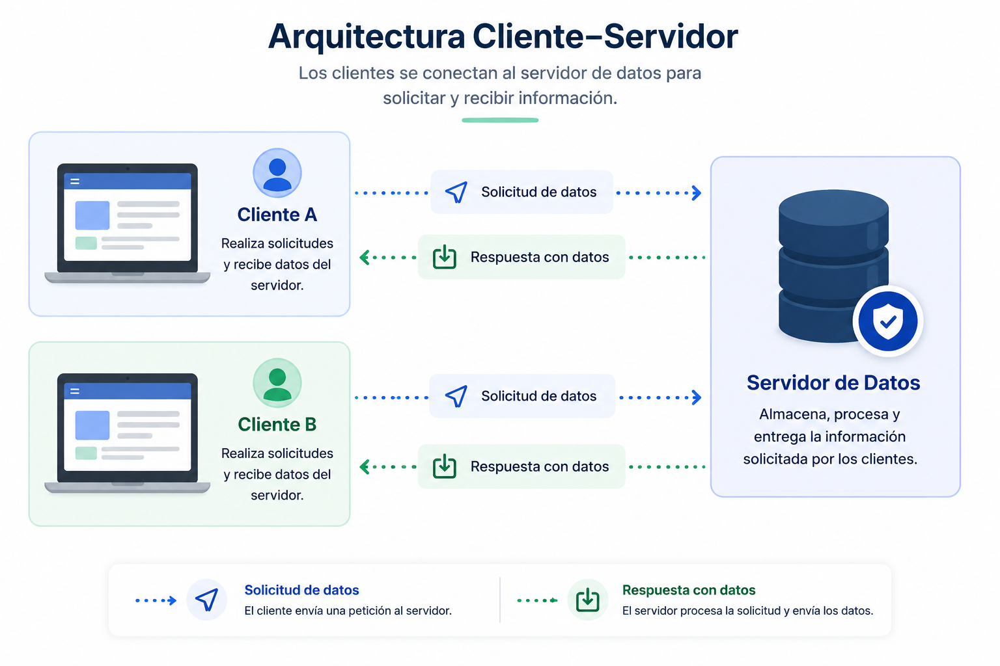

# Arquitectura cliente-servidor

## 1. Definición y concepto

La arquitectura cliente-servidor es un modelo de diseño distribuido de dos capas o niveles (también considerada un tipo de arquitectura de componentes y conectores). En este programa distribuido, los clientes y los servidores se comunican directamente entre sí a través de una red. El flujo principal consiste en que un cliente solicita un recurso o consume un servicio, y el servidor procesa y responde a dicha solicitud. Un único servidor puede gestionar las conexiones de múltiples clientes concurrentes.

**Distribución de la lógica de negocio**
En este diseño, el componente cliente suele incluir el código de la interfaz de usuario, mientras que el servidor gestiona el acceso a la base de datos y los recursos centralizados. La lógica de negocio puede residir en ambos extremos, aunque la mayor parte tiende a centralizarse en el servidor (ya sea en los componentes de software, en la base de datos, o en ambos).

Según la distribución de esta lógica, se categoriza al cliente en dos tipos:

- **Cliente pesado (fat client):** Contiene la mayor parte de la lógica de negocio y procesamiento.
- **Cliente ligero (thin client):** La mayor parte de la funcionalidad reside en el servidor. Este enfoque es preferible en la industria moderna porque facilita enormemente el despliegue y la actualización.

**Desafíos de consistencia**
En la mayoría de las implementaciones, la lógica de la aplicación se distribuye entre el cliente y el servidor. Es imperativo mantener consistencia arquitectónica para identificar dónde reside cada pieza de lógica. La falta de control provoca duplicación de código; por ejemplo, la validación de datos en un formulario (el cliente valida para experiencia de usuario y el servidor valida por seguridad). Aunque centralizar esto requeriría una conexión adicional, la duplicación reduce la mantenibilidad, obligando a modificar múltiples repositorios ante un cambio en las reglas de negocio.

## Diagrama de arquitectura Cliente-Servidor



**Ventajas principales**

- **Rendimiento mejorado:** Distribuye las tareas de procesamiento entre el hardware del cliente y el servidor.
- **Escalabilidad:** Permite agregar más clientes sin alterar el servidor, o escalar el servidor (vertical u horizontalmente) para soportar mayor carga de trabajo.
- **Seguridad:** El servidor central se puede asegurar de manera aislada del cliente, protegiendo datos sensibles y previniendo accesos no autorizados.
- **Gestión centralizada:** Facilita el mantenimiento, las copias de seguridad y las actualizaciones de recursos.

**Desventajas principales**

- **Dependencia del servidor:** Introduce un punto único de fallo (SPOF). Si el servidor se inactiva, la aplicación deja de operar.
- **Complejidad de red:** Depende intrínsecamente de la conexión de red; factores como la latencia o la falta de conectividad limitan su viabilidad.
- **Complejidad operativa:** Requiere la configuración y el mantenimiento separado de dos entornos distintos (cliente y servidor).
- **Costos:** La infraestructura de hardware especializado y redes puede incrementar los costos de implementación.

---

## 2. Casos de uso

### Cuándo sí se debe utilizar

Esta arquitectura es óptima cuando se requiere centralización de datos, seguridad estricta y acceso concurrente por parte de múltiples usuarios en diferentes ubicaciones físicas.

- **Aplicaciones web y HTTP:** Sitios web y plataformas SaaS donde el navegador actúa como cliente ligero.
- **Sistemas de correo electrónico:** Servidores centralizados (SMTP/IMAP) que gestionan el flujo de mensajes hacia clientes locales o web.
- **Recursos compartidos en red:** Impresoras en red o sistemas de archivos corporativos administrados centralmente.
- **Sistemas transaccionales:** Aplicaciones bancarias o sistemas de reservas donde la única fuente de verdad debe residir en un entorno seguro y aislado.

### Cuándo no se debe utilizar

No es recomendable en escenarios donde la red es intermitente, se requiere disponibilidad estricta sin conexión o la latencia de red es inaceptable.

- **Aplicaciones de escritorio autónomas:** Software de edición de video o procesadores de texto locales que no requieren colaboración en tiempo real.
- **Sistemas de tiempo real crítico (hard real-time):** Sistemas de frenado automotriz o maquinaria médica donde el retardo de milisegundos por el viaje en red puede ser fatal.
- **Redes altamente descentralizadas:** Sistemas de intercambio de archivos masivos donde una arquitectura _Peer-to-Peer_ (P2P) distribuye mejor la carga que un servidor central.

---

## 3. Diagramas UML

Para documentar y modelar esta arquitectura de manera técnica, se emplean principalmente tres diagramas UML:

1. **Diagrama de despliegue (Deployment diagram):** Es el más importante para la arquitectura cliente-servidor. Modela la topología física del sistema, ilustrando los nodos de hardware (dispositivos móviles, computadoras personales, servidores en la nube) y los protocolos de comunicación entre ellos (HTTPS, TCP/IP).
2. **Diagrama de componentes (Component diagram):** Detalla la estructura interna de las unidades de software. Muestra cómo se agrupan las interfaces de usuario en el cliente y cómo el servidor se subdivide en controladores, servicios y repositorios de datos, definiendo interfaces explícitas (API) entre el cliente y el servidor.
3. **Diagrama de secuencia (Sequence diagram):** Captura el comportamiento dinámico. Modela el flujo temporal de peticiones y respuestas; por ejemplo, la secuencia exacta desde que el usuario hace clic en el cliente, la petición viaja por la red, el servidor consulta la base de datos y retorna la carga útil (payload).

---

## 4. Plan de pruebas

| Nivel de prueba              | Componente objetivo                 | Estrategia y enfoque                                                                                                                                                                                                     |
| ---------------------------- | ----------------------------------- | ------------------------------------------------------------------------------------------------------------------------------------------------------------------------------------------------------------------------ |
| **Pruebas unitarias**        | Lógica aislada (Cliente y servidor) | Evaluar funciones, métodos y clases individuales utilizando _mocks_ para eliminar dependencias externas. En el cliente: validaciones locales y renderizado UI. En el servidor: algoritmos de negocio y cálculo de datos. |
| **Pruebas de integración**   | Comunicación entre capas            | Validar la interacción entre el servidor y la base de datos (repositorios) y el cumplimiento de los contratos de la API (respuestas JSON esperadas, códigos de estado HTTP) sin ejecutar la interfaz gráfica.            |
| **Pruebas de contrato**      | Interfaz cliente-servidor           | Garantizar que los esquemas de datos enviados por el cliente coincidan con lo que el servidor espera, y viceversa, aislando los entornos para evitar roturas de compatibilidad.                                          |
| **Pruebas end-to-end (E2E)** | Sistema completo                    | Simular el comportamiento del usuario desde el cliente (UI), atravesando la red real, pasando por el servidor hasta la base de datos, asegurando que todo el ecosistema distribuido funcione en conjunto.                |
| **Pruebas de carga/estrés**  | Servidor central                    | Someter al servidor a un alto volumen de peticiones concurrentes para identificar cuellos de botella y comprobar las capacidades de escalabilidad y tolerancia a fallos.                                                 |

---

## 5. Estructura de carpetas

El siguiente es un árbol de directorios estándar para una arquitectura cliente-servidor estructurada como un monorepositorio, separando claramente las responsabilidades.

```text
proyecto-cliente-servidor/
├── client/                     # Capa del cliente (Frontend)
│   ├── src/
│   │   ├── components/         # Interfaz de usuario (botones, formularios)
│   │   ├── services/           # Clientes HTTP para comunicarse con el servidor
│   │   ├── views/              # Vistas principales de la aplicación
│   │   └── utils/              # Lógica de validación local compartida
│   ├── package.json
│   └── tsconfig.json
│
├── server/                     # Capa del servidor (Backend)
│   ├── src/
│   │   ├── controllers/        # Gestión de peticiones y respuestas HTTP
│   │   ├── services/           # Lógica de negocio principal centralizada
│   │   ├── models/             # Esquemas y modelado de datos
│   │   ├── routes/             # Definición de endpoints de la API
│   │   └── index.ts            # Punto de entrada del servidor
│   ├── package.json
│   └── tsconfig.json
│
└── README.md

```

---

## 6. Ejemplo de código comentado

El siguiente ejemplo minimalista en **TypeScript** demuestra la interacción fundamental. Se utiliza Node.js/Express para el servidor y la API `fetch` estándar para el cliente.

### Servidor (Backend)

```typescript
// server/src/index.ts
import express, { Request, Response } from "express";

const app = express();
const PORT = 3000;

// Middleware para parsear JSON
app.use(express.json());

// Base de datos simulada en memoria
const users = [
  { id: 1, name: "Ana", active: true },
  { id: 2, name: "Carlos", active: false },
];

/**
 * Endpoint de lectura.
 * Actúa como la interfaz para que el cliente solicite recursos.
 * Aplica lógica de negocio simple (ej: filtrar usuarios activos).
 */
app.get("/api/users/active", (req: Request, res: Response) => {
  // Lógica de negocio ejecutada en el servidor (Thin client architecture)
  const activeUsers = users.filter((user) => user.active);

  // El servidor responde a la petición del cliente con un estado y datos
  res.status(200).json({
    success: true,
    data: activeUsers,
  });
});

app.listen(PORT, () => {
  console.log(`Servidor escuchando en el puerto ${PORT}`);
});
```

### Cliente (Frontend)

```typescript
// client/src/services/userService.ts

/**
 * Función del cliente que solicita un recurso al servidor.
 * Delega el procesamiento complejo al servidor y solo consume el resultado.
 */
async function fetchActiveUsers(): Promise<void> {
  try {
    // El cliente inicia la solicitud HTTP a través de la red
    const response = await fetch("http://localhost:3000/api/users/active");

    if (!response.ok) {
      throw new Error(`Error en el servidor: ${response.status}`);
    }

    // El cliente procesa la respuesta entregada por el servidor
    const result = await response.json();

    // Lógica de interfaz de usuario (ej: renderizado en consola/pantalla)
    console.log("Usuarios activos recibidos:", result.data);
  } catch (error) {
    // Manejo de errores de red o disponibilidad del servidor central (Desventaja inherente)
    console.error("Fallo la comunicación con el servidor:", error);
  }
}

// Ejecución de la petición
fetchActiveUsers();
```

### Explicación técnica del flujo de ejecución

1. **Inicialización:** El proceso del servidor arranca y se queda escuchando en el puerto TCP 3000, a la espera de peticiones entrantes.
2. **Petición (Request):** La función `fetchActiveUsers` en el cliente ejecuta una solicitud HTTP GET. Esta petición viaja a través de la capa de red hasta llegar a la dirección IP y puerto del servidor.
3. **Procesamiento y enrutamiento:** El servidor recibe la petición y la enruta a través de Express al controlador asociado a la ruta `/api/users/active`.
4. **Ejecución de lógica de negocio:** El servidor consulta el repositorio de datos (en este caso, un arreglo en memoria) y aplica el filtrado (lógica de negocio).
5. **Respuesta (Response):** El servidor empaqueta los resultados procesados en formato JSON y los transmite de vuelta al cliente con un código de estado HTTP 200 (OK).
6. **Consumo:** El cliente recibe el paquete de red, deserializa el JSON y utiliza los datos exclusivamente para la capa de presentación, finalizando así el ciclo.

---

## Fuentes y atribuciones

### Fuente principal

- Curso: _Arquitectura de software en aplicaciones_.
- Plataforma: Educative.io.

### Asistencia de IA

- Gemini AI: apoyo en la ampliación, organización y síntesis del contenido teórico.
- ChatGPT: generación de diagramas explicativos..
