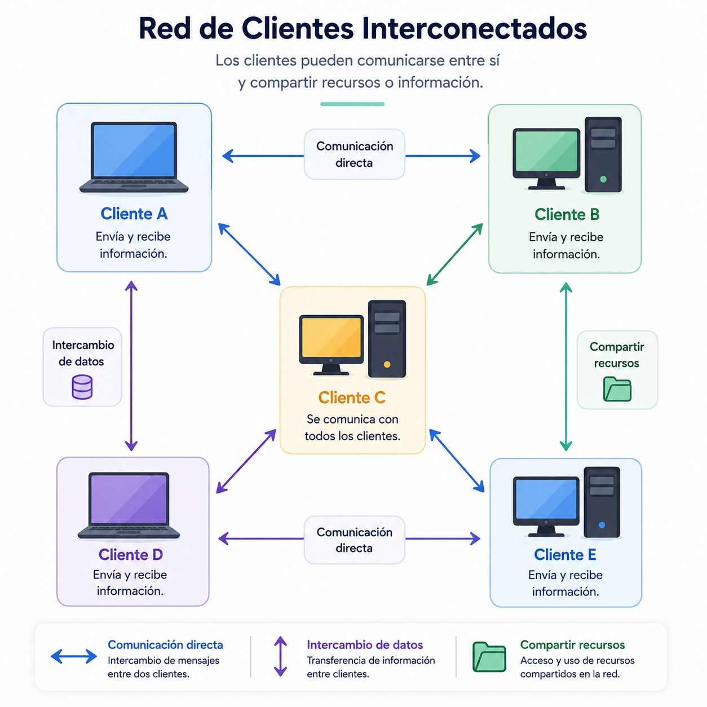

A continuación, se presenta un análisis técnico y detallado sobre la arquitectura Peer to Peer (P2P), estructurado según los requerimientos propios de la ingeniería de software y el modelado de sistemas.

## Definición y concepto

En una arquitectura tradicional cliente-servidor, múltiples clientes se comunican con servidores centralizados que gestionan y proveen los recursos. En contraste, la arquitectura Peer to Peer (P2P) opera bajo un modelo de red descentralizada donde los nodos de la red actúan simultáneamente como clientes y servidores. A estos nodos se les denomina "pares" (peers).

En este modelo, la carga de trabajo y los recursos (como almacenamiento, procesamiento o ancho de banda) se distribuyen entre los participantes del sistema sin la necesidad de un servidor central. Casi todos los nodos aportan y consumen recursos, con la excepción de los nodos periféricos (edge peers), cuya función se limita exclusivamente al consumo.

Existen tres clasificaciones principales dentro de esta arquitectura:

- **Pura:** Todos los nodos poseen los mismos privilegios y responsabilidades. No existe un servidor central ni autoridad de coordinación. Todo el enrutamiento y descubrimiento se realiza de forma distribuida.
- **Híbrida:** Incorpora elementos centralizados. Algunos nodos asumen roles especiales o responsabilidades de infraestructura, tales como la indexación de recursos, el descubrimiento de pares o la gestión de la comunicación inicial (ej. servidores _tracker_).
- **Estructurada:** Los nodos y los recursos se organizan mediante una topología específica (frecuentemente utilizando Tablas de Hash Distribuidas o DHT) para garantizar que las consultas de recursos sean predecibles y eficientes.

## Diagrama de arquitectura Peer to Peer

## 

## Casos de uso

La viabilidad de implementar una arquitectura P2P depende estrictamente de los requisitos no funcionales del sistema, tales como tolerancia a fallos, consistencia y seguridad.

### Cuándo SÍ utilizar la arquitectura P2P

- **Alta tolerancia a fallos y descentralización:** Cuando el sistema no puede permitirse un punto único de fallo. Si un nodo se desconecta, la red continúa operando mediante los nodos restantes.
- **Distribución de grandes volúmenes de datos:** Sistemas de intercambio de archivos (File sharing) o entrega de contenido, donde la distribución del ancho de banda entre usuarios reduce los costos de infraestructura (ej. BitTorrent).
- **Computación distribuida:** Procesamiento de tareas computacionalmente costosas distribuyendo fragmentos del trabajo entre múltiples máquinas (ej. BOINC).
- **Sistemas de registros inmutables y criptomonedas:** Aplicaciones que requieren un libro mayor distribuido y auditado por consenso público (ej. Bitcoin, Ethereum).
- **IoT (Internet de las cosas):** Redes de dispositivos interconectados que requieren comunicación directa en entornos locales sin depender de un enrutamiento en la nube.

### Cuándo NO utilizar la arquitectura P2P

- **Sistemas transaccionales con consistencia estricta (ACID):** Entornos financieros tradicionales o bases de datos relacionales donde garantizar la sincronización y el bloqueo de registros en tiempo real a través de una red distribuida resulta ineficiente o inviable.
- **Requisitos de seguridad y control de acceso centralizados:** Sistemas que manejan información altamente confidencial (datos médicos, gubernamentales) donde la exposición de la red o el enrutamiento a través de nodos de terceros representa un riesgo de seguridad o incumplimiento legal.
- **Baja latencia garantizada:** Redes donde el tiempo de respuesta debe ser mínimo y determinista. En P2P, las peticiones pueden requerir múltiples saltos de enrutamiento impredecibles.
- **Dispositivos con recursos limitados:** Dado que los nodos también actúan como servidores, consumen ancho de banda, batería y capacidad de procesamiento continuo en segundo plano.

---

## Diagramas UML

Para modelar adecuadamente un sistema P2P, se recomienda utilizar un conjunto específico de diagramas UML que capturen tanto la topología estática como el comportamiento dinámico.

1. **Diagrama de despliegue:** Es el diagrama más crítico en P2P. Permite visualizar la topología de la red, ilustrando cómo los nodos (dispositivos físicos) se interconectan directamente. Es útil para modelar redes puras (grafos descentralizados) o redes híbridas (mostrando la conexión a un nodo índice o _tracker_).
2. **Diagrama de componentes:** Se utiliza para modelar la estructura interna de un nodo par. Permite definir de forma aislada los módulos de red (sockets), almacenamiento local, capa de consenso, interfaz de usuario y los protocolos de comunicación y descubrimiento.
3. **Diagrama de secuencia:** Fundamental para documentar el comportamiento temporal y los protocolos de comunicación. Se aplica para ilustrar procesos complejos como el _handshake_ (apretón de manos) inicial, el descubrimiento de un recurso específico mediante _gossip protocol_ (protocolo de chismes) y la posterior transferencia de datos entre el Nodo A, el Nodo B y un posible Nodo C.

---

## Plan de pruebas

Dada la naturaleza distribuida e impredecible de la red, el aseguramiento de la calidad en una arquitectura P2P requiere una estrategia orientada a la simulación de redes y la concurrencia.

| Nivel de prueba                    | Estrategia y objetivo técnico                                                                                                                                                                                                                     |
| ---------------------------------- | ------------------------------------------------------------------------------------------------------------------------------------------------------------------------------------------------------------------------------------------------- |
| **Pruebas unitarias**              | Validar la lógica aislada de cada módulo del nodo. Se debe simular (mockear) la capa de red para probar los algoritmos de enrutamiento, cifrado, generación de hashes y serialización de mensajes sin requerir conexiones reales.                 |
| **Pruebas de integración**         | Instanciar localmente entre 2 y 5 nodos en diferentes puertos dentro de la misma máquina. Validar el descubrimiento de pares, la correcta formación de la conexión bidireccional y el intercambio de mensajes estructurados.                      |
| **Pruebas de rendimiento / Carga** | Someter a los nodos a altos volúmenes de peticiones concurrentes. Evaluar el consumo de memoria y CPU para evitar fugas (_memory leaks_) que afecten la capacidad del dispositivo de operar como servidor continuo.                               |
| **Pruebas de tolerancia a fallos** | Introducir "Ingeniería del caos". Conectar múltiples nodos e inducir caídas repentinas (matar procesos), alta latencia o pérdida de paquetes. Validar que la red recompone sus tablas de enrutamiento sin colapsar.                               |
| **Pruebas E2E (End-to-End)**       | Despliegue en entornos reales o máquinas virtuales geográficamente distribuidas. Evaluar el ciclo completo: conexión a la red de prueba (Testnet), descubrimiento dinámico de pares, transferencia completa de recursos y desconexión controlada. |

---

## Estructura de carpetas

La siguiente estructura ilustra el código fuente de un nodo P2P implementado en un entorno de desarrollo estándar. La modularidad garantiza la separación de responsabilidades entre la capa de red y la lógica de dominio.

```text
p2p-node/
├── src/
│   ├── index.ts                 # Punto de entrada de la aplicación
│   ├── network/                 # Capa de comunicación y conexiones
│   │   ├── peer.ts              # Lógica central del nodo (Cliente + Servidor)
│   │   ├── connectionManager.ts # Gestión de sockets activos y desconexiones
│   │   └── protocols.ts         # Definición de tipos de mensajes y parseo
│   ├── domain/                  # Lógica de negocio (ej. Blockchain, Archivos)
│   │   ├── messageHandler.ts    # Procesamiento de mensajes entrantes
│   │   └── nodeState.ts         # Estado en memoria (pares conocidos, datos)
│   ├── utils/
│   │   ├── logger.ts            # Registro de eventos de red
│   │   └── cryptography.ts      # Generación de firmas e identificadores
│   └── config/
│       └── settings.ts          # Puertos, hosts y nodos semilla por defecto
├── package.json
├── tsconfig.json
└── README.md

```

---

## Ejemplo de código comentado

A continuación, se presenta una implementación minimalista y funcional en **TypeScript** utilizando el módulo nativo `net` (TCP) de Node.js. Este código demuestra el concepto central de P2P: un mismo proceso abre un servidor para escuchar conexiones y, simultáneamente, actúa como cliente al conectarse a otros servidores.

```typescript
import * as net from "net";

/**
 * Clase principal que representa un nodo en la red P2P.
 * Asume la responsabilidad dual: actuar como Servidor (escuchar) y Cliente (conectar).
 */
class PeerNode {
  private server: net.Server;
  private connections: net.Socket[] = [];
  private port: number;

  constructor(port: number) {
    this.port = port;

    // 1. Instanciación del componente SERVIDOR
    // Se crea un servidor TCP que reaccionará cuando otro par intente conectarse.
    this.server = net.createServer((socket: net.Socket) => {
      console.log(
        `[Recepción] Nueva conexión entrante desde: ${socket.remoteAddress}:${socket.remotePort}`,
      );
      this.handleConnection(socket);
    });
  }

  /**
   * Inicia el servidor para aceptar conexiones entrantes.
   */
  public start(): void {
    this.server.listen(this.port, () => {
      console.log(`[Sistema] Nodo escuchando en el puerto ${this.port}...`);
    });
  }

  /**
   * Componente CLIENTE.
   * Intenta establecer una conexión TCP hacia otro nodo conocido en la red.
   * @param targetHost Dirección IP del nodo destino.
   * @param targetPort Puerto del nodo destino.
   */
  public connectToPeer(targetHost: string, targetPort: number): void {
    console.log(
      `[Conexión] Intentando conectar con el par ${targetHost}:${targetPort}...`,
    );

    const socket = new net.Socket();
    socket.connect(targetPort, targetHost, () => {
      console.log(
        `[Éxito] Conectado exitosamente al par ${targetHost}:${targetPort}`,
      );
      this.handleConnection(socket);
    });

    // Manejo básico de errores para evitar la caída del nodo si el destino no responde
    socket.on("error", (err) => {
      console.error(
        `[Error] Fallo al conectar con ${targetHost}:${targetPort} - ${err.message}`,
      );
    });
  }

  /**
   * Envía un mensaje en formato cadena a todos los pares conectados (Broadcasting).
   * @param data Datos a transmitir en la red.
   */
  public broadcast(data: string): void {
    this.connections.forEach((socket) => {
      // Se valida que el socket no esté destruido antes de escribir
      if (!socket.destroyed) {
        socket.write(data);
      }
    });
  }

  /**
   * Gestiona el ciclo de vida y los eventos de una conexión TCP activa.
   * @param socket El canal de comunicación establecido con un par.
   */
  private handleConnection(socket: net.Socket): void {
    // Almacena el socket activo en la lista de conexiones del nodo
    this.connections.push(socket);

    // Evento: Recepción de datos desde este par
    socket.on("data", (data: Buffer) => {
      console.log(`[Mensaje Recibido] ${data.toString().trim()}`);
    });

    // Evento: Desconexión del par
    socket.on("close", () => {
      console.log(`[Desconexión] Se ha perdido la conexión con un par.`);
      // Se elimina el socket inactivo del estado del nodo
      this.connections = this.connections.filter((conn) => conn !== socket);
    });
  }
}

// ==========================================
// Flujo de ejecución simulado
// ==========================================

// Se captura el puerto por argumento de línea de comandos (ej. node dist/index.js 3000)
const port = parseInt(process.argv[2]) || 3000;
const node = new PeerNode(port);

// 1. El nodo inicializa su servidor
node.start();

// 2. Si se proporciona un puerto adicional en los argumentos, el nodo actuará como cliente e intentará conectarse
const targetPort = parseInt(process.argv[3]);
if (targetPort) {
  node.connectToPeer("127.0.0.1", targetPort);
}

// 3. Simulación de un sistema de mensajes estándar (gossip) cada 5 segundos
setInterval(() => {
  node.broadcast(`Saludos desde el nodo en el puerto ${port}\n`);
}, 5000);
```

### Explicación técnica del flujo de ejecución

1. **Inicialización:** Al ejecutar el script, la clase `PeerNode` instancia un servidor TCP en un puerto específico mediante `net.createServer()`. A partir de este momento, el proceso es capaz de recibir tráfico entrante.
2. **Conexión saliente (Actitud de cliente):** Si el nodo recibe instrucciones de conectarse a otro puerto (por ejemplo, pasándole un argumento al proceso), invoca `connectToPeer()`. Utiliza `new net.Socket().connect(...)` para iniciar un protocolo de establecimiento de conexión TCP ("three-way handshake") hacia la dirección de destino.
3. **Gestión unificada del estado:** Tanto si la conexión fue iniciada por el nodo (cliente) como si fue recibida por el nodo (servidor), ambas derivan en el método `handleConnection(socket)`. Este método inscribe la conexión en un arreglo local en memoria (`this.connections`) y suscribe los eventos de lectura (`data`) y cierre (`close`). Este patrón abstrae la dirección de la conexión original; una vez establecida, la comunicación es bidireccional y simétrica (Peer to Peer pura).
4. **Propagación de datos:** El método `broadcast()` itera sobre la lista de sockets activos e inyecta la información en el flujo de salida. Este mecanismo es la base para el descubrimiento de red y la sincronización de estados en sistemas distribuidos.

---

## Fuentes y atribuciones

### Fuente principal

- Curso: _Software Architecture in Applications_.
- Plataforma: Educative.io.

### Asistencia de IA

- Gemini AI: apoyo en la ampliación, organización técnica y síntesis del contenido teórico.
