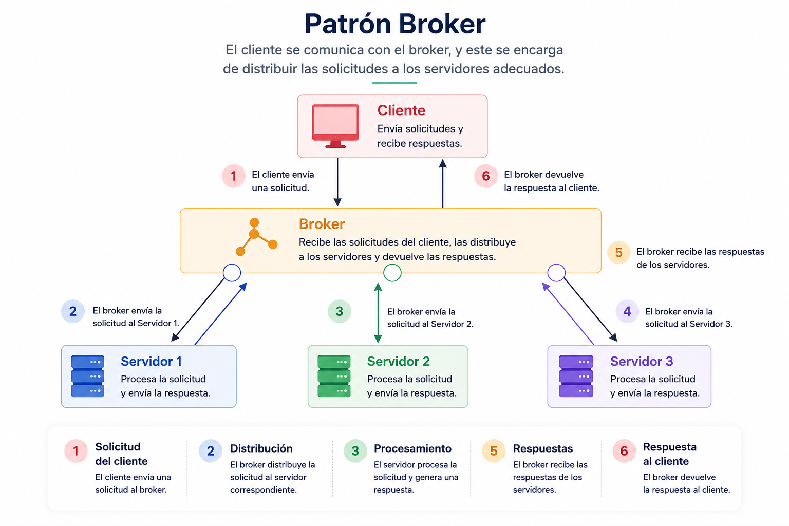

# Patrón arquitectónico Broker

## Definición y concepto

El patrón Broker (también conocido como patrón intermediario) es una estrategia arquitectónica diseñada para estructurar sistemas distribuidos desacoplados. Su función principal es insertar un componente intermedio, denominado _broker_, entre los consumidores de servicios (clientes) y los proveedores de servicios (servidores).

En esta arquitectura, el cliente está completamente separado de los servidores y no posee conocimiento sobre su ubicación de red, estado o detalles de implementación. Cuando un cliente requiere ejecutar una operación, envía una solicitud al broker a través de una interfaz de servicio estandarizada. El broker asume la responsabilidad de localizar el servidor adecuado, enrutar la solicitud, transferir los datos y delegar la ejecución. Posteriormente, el servidor procesa la petición y devuelve el resultado (o las excepciones generadas) al broker, quien finalmente transmite esta respuesta al cliente original.

Esta abstracción resuelve problemas fundamentales en los sistemas distribuidos, como la interoperabilidad, la conexión entre nodos, el intercambio seguro de información y la disponibilidad de los servicios, siendo la base de arquitecturas como CORBA, Enterprise Java Beans (EJB) y la Arquitectura Orientada a Servicios (SOA).

## Casos de uso

La decisión de implementar un patrón Broker debe basarse en las necesidades de distribución y acoplamiento del sistema.

**Cuándo SÍ se debe utilizar:**

- **Sistemas altamente distribuidos:** Cuando la aplicación se compone de múltiples servicios desplegados en diferentes servidores físicos o virtuales y se requiere un punto centralizado para la gestión del tráfico.
- **Arquitecturas orientadas a servicios (SOA) y microservicios:** Donde el descubrimiento dinámico de servicios y el balanceo de carga son requisitos arquitectónicos fundamentales.
- **Sistemas que requieren escalabilidad dinámica:** Permite agregar o eliminar instancias de servidores en tiempo de ejecución sin modificar el código o la configuración de los clientes.
- **Integración de sistemas heterogéneos:** Cuando los clientes y servidores están escritos en diferentes lenguajes de programación o utilizan diferentes protocolos subyacentes, actuando el broker como un traductor de comunicaciones.

**Cuándo NO se debe utilizar:**

- **Aplicaciones monolíticas o locales:** Introducir un broker en procesos que se ejecutan en la misma máquina o espacio de memoria añade una complejidad innecesaria.
- **Sistemas con requisitos críticos de baja latencia:** El broker añade un salto de red adicional (network hop) y tiempo de procesamiento (serialización/deserialización), lo que introduce una sobrecarga de rendimiento.
- **Sistemas con recursos limitados:** El desarrollo y mantenimiento de la infraestructura del intermediario incrementa el tiempo de desarrollo y los costos operativos.

## Diagrama de Patrón arquitectónico broker

## 

## Diagramas UML

Para documentar y modelar correctamente esta arquitectura, se recomiendan los siguientes diagramas UML:

- **Diagrama de componentes:** Esencial para visualizar la separación estructural del sistema. Muestra el componente Cliente, el componente Servidor y el componente Broker en el centro, exponiendo las interfaces requeridas y provistas (ej. `IClient`, `IBroker`, `IServer`). Demuestra visualmente que no existe una dependencia directa entre cliente y servidor.
- **Diagrama de secuencia:** Crucial para modelar el flujo de ejecución y la comunicación asíncrona o síncrona. Documenta el ciclo de vida de una petición: el cliente invoca al broker, el broker consulta su registro (naming service) para encontrar el servidor, reenvía la petición, el servidor procesa, responde al broker, y el broker responde al cliente.
- **Diagrama de despliegue:** Necesario por la naturaleza distribuida del patrón. Modela cómo los artefactos de software (clientes, brokers, servidores) se distribuyen a través de nodos físicos o contenedores en la red, ilustrando los protocolos de comunicación (TCP/IP, HTTP, gRPC) entre ellos.

## Plan de pruebas

| Tipo de prueba          | Componente objetivo            | Estrategia y descripción                                                                                                                                                   |
| ----------------------- | ------------------------------ | -------------------------------------------------------------------------------------------------------------------------------------------------------------------------- |
| **Unitarias**           | Lógica de negocio (Servidores) | Verificar que cada servicio procese correctamente las entradas simuladas (mocks) y retorne las salidas o excepciones esperadas de forma aislada.                           |
| **Unitarias**           | Enrutamiento (Broker)          | Probar la lógica interna del broker: registro de servicios, descubrimiento y manejo de errores cuando un servicio no existe. Aislar la capa de red.                        |
| **Integración**         | Cliente - Broker               | Validar que el cliente serializa y envía correctamente los mensajes al broker, y que es capaz de interpretar la respuesta o error devuelto.                                |
| **Integración**         | Broker - Servidor              | Asegurar que el broker transmite íntegramente la carga útil (payload) al servidor correcto y que el contrato de comunicación se respeta.                                   |
| **End-to-end (E2E)**    | Sistema completo               | Simular el flujo real: inicio de un cliente, solicitud de un servicio, tránsito por el broker, ejecución en el servidor y entrega de la respuesta al cliente.              |
| **Rendimiento / Carga** | Infraestructura del Broker     | Someter al broker a un alto volumen de peticiones concurrentes para identificar cuellos de botella de red, sobrecarga de procesamiento y validar su capacidad de balanceo. |

## Estructura de carpetas

A continuación, se presenta una estructura de directorios estándar para un proyecto modular utilizando este patrón:

```text
proyecto-broker/
├── src/
│   ├── broker/
│   │   ├── Broker.ts              # Implementación central del intermediario
│   │   ├── Registry.ts            # Registro y descubrimiento de servicios
│   │   └── NetworkListener.ts     # Escucha de conexiones entrantes
│   ├── client/
│   │   ├── Client.ts              # Implementación del consumidor
│   │   └── index.ts               # Punto de entrada para inicializar clientes
│   ├── server/
│   │   ├── services/
│   │   │   ├── PaymentService.ts  # Proveedor de servicio específico
│   │   │   └── EmailService.ts    # Proveedor de servicio específico
│   │   ├── ServerWorker.ts        # Instancia que conecta servicios al broker
│   │   └── index.ts               # Punto de entrada para levantar servidores
│   └── shared/
│       ├── interfaces/
│       │   ├── IMessage.ts        # Contrato de datos transferidos
│       │   └── IService.ts        # Interfaz que deben cumplir los servidores
│       └── utils/
│           └── Logger.ts          # Herramientas transversales
├── tests/
│   ├── unit/
│   ├── integration/
│   └── e2e/
├── package.json
└── tsconfig.json

```

## Ejemplo de código comentado

El siguiente ejemplo en **TypeScript** ilustra una implementación funcional en memoria del patrón Broker.

```typescript
// --- 1. Contratos Compartidos (Shared) ---

// Define la estructura estandarizada de los mensajes intercambiados
interface BrokerMessage {
  serviceName: string;
  payload: any;
}

// Define la interfaz que todo proveedor de servicio debe implementar
interface ServiceProvider {
  getName(): string;
  execute(payload: any): Promise<any>;
}

// --- 2. Proveedores de Servicio (Servers) ---

// Implementación concreta de un servicio de procesamiento
class DataProcessingService implements ServiceProvider {
  getName(): string {
    return "DataProcessor";
  }

  // Lógica de negocio del servidor
  async execute(payload: any): Promise<any> {
    console.log(`[Servidor] Procesando datos:`, payload);
    // Simulación de procesamiento asíncrono
    return { status: "success", result: payload.value * 2 };
  }
}

// --- 3. El Intermediario (Broker) ---

class MessageBroker {
  // Registro interno para mapear nombres de servicios a sus instancias
  private registry: Map<string, ServiceProvider> = new Map();

  // Permite a los servidores registrarse en el broker para ser descubiertos
  public registerService(service: ServiceProvider): void {
    this.registry.set(service.getName(), service);
    console.log(`[Broker] Servicio registrado: ${service.getName()}`);
  }

  // Punto de entrada para las peticiones de los clientes
  public async forwardRequest(message: BrokerMessage): Promise<any> {
    console.log(
      `[Broker] Petición recibida para el servicio: ${message.serviceName}`,
    );

    const service = this.registry.get(message.serviceName);

    if (!service) {
      throw new Error(
        `[Broker] Error: El servicio '${message.serviceName}' no está disponible.`,
      );
    }

    try {
      // El broker delega la ejecución al servidor correspondiente
      const response = await service.execute(message.payload);
      console.log(
        `[Broker] Respuesta recibida del servidor, enviando al cliente.`,
      );
      return response;
    } catch (error) {
      // El broker maneja y enruta las excepciones de vuelta al cliente
      throw new Error(`[Broker] Falla en la ejecución del servicio: ${error}`);
    }
  }
}

// --- 4. Consumidor (Client) ---

class Client {
  private broker: MessageBroker;

  // El cliente solo conoce al broker, no a los servidores
  constructor(broker: MessageBroker) {
    this.broker = broker;
  }

  public async requestProcessing(dataValue: number): Promise<void> {
    console.log(
      `[Cliente] Solicitando procesamiento para el valor: ${dataValue}`,
    );

    const request: BrokerMessage = {
      serviceName: "DataProcessor",
      payload: { value: dataValue },
    };

    try {
      // El cliente envía la petición al broker y espera el resultado
      const result = await this.broker.forwardRequest(request);
      console.log(`[Cliente] Resultado obtenido:`, result);
    } catch (error) {
      console.error(`[Cliente] Error capturado:`, error);
    }
  }
}

// --- 5. Flujo de Ejecución (Main) ---

async function main() {
  // 1. Inicialización de la infraestructura
  const broker = new MessageBroker();

  // 2. Despliegue de servidores (Service Providers)
  const processorService = new DataProcessingService();
  broker.registerService(processorService);

  // 3. Inicialización del cliente
  const client = new Client(broker);

  // 4. Ejecución de la operación
  console.log("--- Iniciando transacción ---");
  await client.requestProcessing(42);
  console.log("--- Transacción finalizada ---");
}

main();
```

### Explicación del flujo de ejecución

1. **Inicialización y registro:** Se instancia el `MessageBroker`. Luego, se crea una instancia del servidor (`DataProcessingService`) y se registra en el broker. El servidor ahora está listo para recibir peticiones, pero no busca clientes activamente.
2. **Invocación del cliente:** Se instancia el `Client`, inyectándole la dependencia del broker. El cliente invoca `requestProcessing()`, construyendo un `BrokerMessage` estandarizado indicando el nombre del servicio deseado ("DataProcessor") y los datos.
3. **Enrutamiento del broker:** El broker recibe el mensaje en `forwardRequest()`. Inspecciona el `serviceName` y busca en su registro en memoria. Al encontrar la instancia correcta, transfiere el control llamando a `execute()` del servidor.
4. **Procesamiento y retorno:** El servidor procesa la lógica de negocio subyacente y retorna la respuesta al broker. El broker recibe esta respuesta y la devuelve intacta al flujo de ejecución del cliente. El cliente, ajeno a quién o dónde se procesó la información, procesa el resultado final.

---

## Fuentes y atribuciones

### Fuente principal

- Curso: _Software Architecture in Applications_.
- Plataforma: Educative.io.

### Asistencia de IA

- Gemini AI: apoyo en la ampliación, organización y síntesis del contenido teórico.
- ChatGPT: generación de diagramas explicativos.
