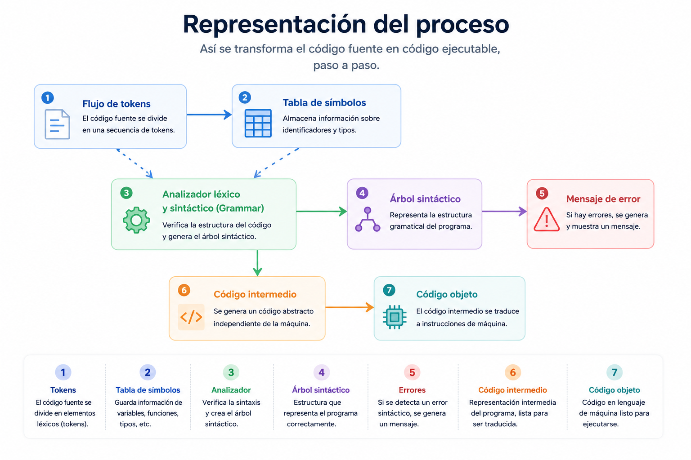
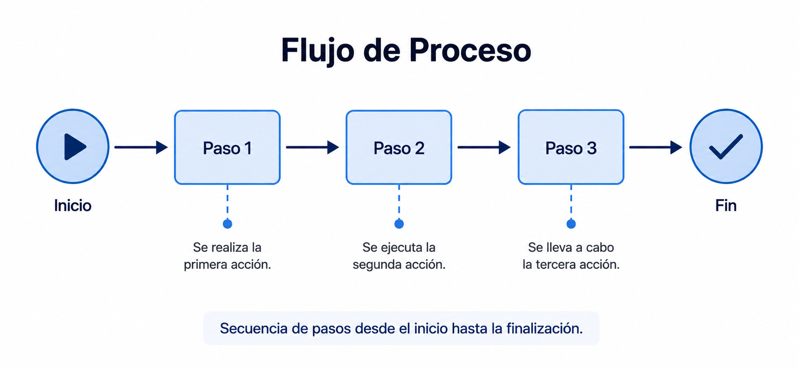
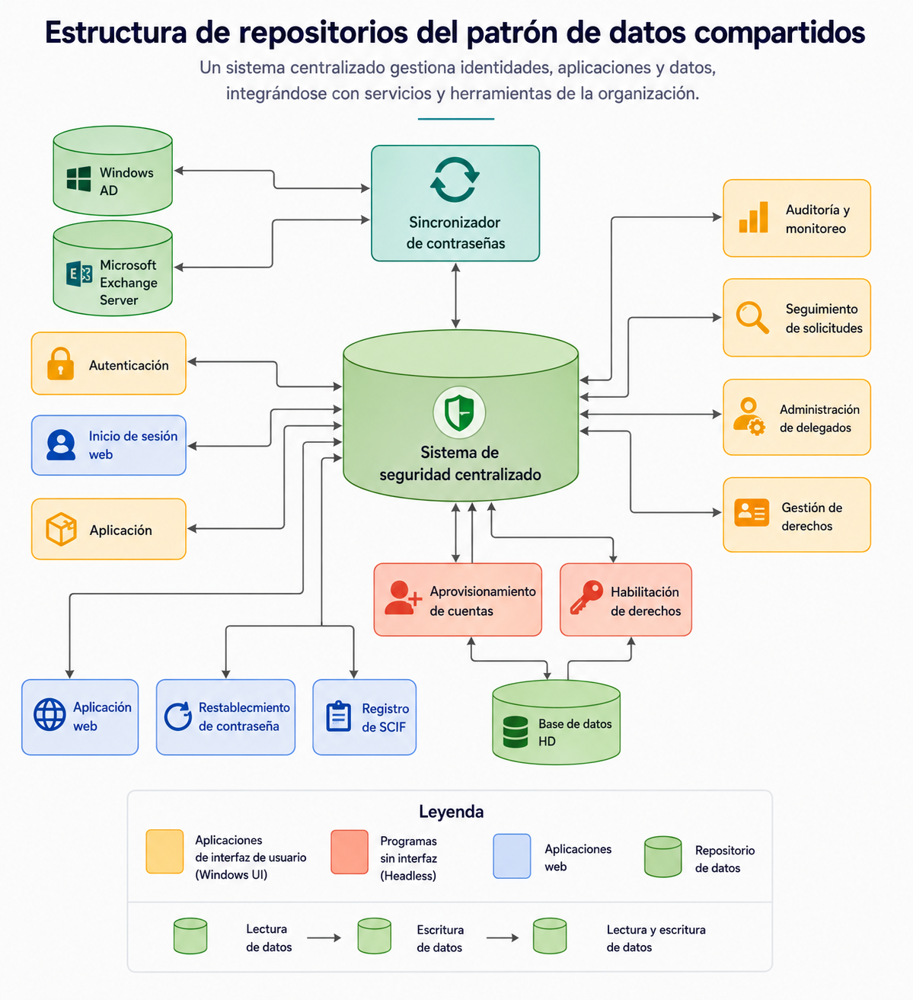

# Arquitectura Pipe and Filter

## Definición y concepto

El patrón arquitectónico **Pipe and Filter** (Tuberías y Filtros) organiza un sistema alrededor del procesamiento de un flujo de datos. Su principio fundamental consiste en dividir una tarea compleja en una serie de procesos independientes y reutilizables.

Los componentes principales de esta arquitectura son:

- **Filtro (Filter):** Es la unidad de procesamiento. Lee datos de su entrada, los transforma, enriquece o filtra, y los escribe en su salida. Los filtros son independientes entre sí y no comparten estado con otros filtros.
- **Tubería (Pipe):** Es el canal de comunicación o conector que transporta los datos entre los filtros. Actúa como un búfer o medio de sincronización. Unidireccionalmente, transfiere el flujo de salida de un filtro hacia la entrada del siguiente.
- **Bomba (Pump) o productor:** Es la fuente de datos que alimenta el inicio de la tubería.
- **Sumidero (Sink) o consumidor:** Es el destino final de los datos procesados, responsable de almacenar o presentar el resultado.

Desde el punto de vista de los **atributos de calidad** (Quality Attributes), este estilo favorece la _mantenibilidad_ y la _reusabilidad_, ya que los componentes están altamente desacoplados. Sin embargo, puede presentar desafíos en el _rendimiento_ (performance) debido a la sobrecarga de transferencia de datos y transformación continua entre los filtros.

## Diagrama de arquitectura Pipe and Filter

## 

## Descripción de la arquitectura

Para mejorar la eficiencia y flexibilidad, los sistemas que manejan la transformación de datos deben dividirse en componentes independientes y reutilizables. Estos componentes se comunican entre sí mediante mecanismos de interacción simples y genéricos, lo que permite combinarlos y reutilizarlos con facilidad. Además, al ser independientes y estar débilmente acoplados, pueden ejecutarse en paralelo.

El patrón de tuberías y filtros es una técnica clásica para organizar sistemas de transformación de datos. Cada filtro ejecuta una transformación específica sobre los datos de entrada y entrega los datos convertidos al siguiente filtro a través de una tubería. Un solo filtro puede aceptar y entregar datos a una o múltiples tuberías.

## 

## Patrón de datos compartidos

El patrón de datos compartidos es una variante de la arquitectura de tuberías y filtros. Se implementa cuando múltiples componentes informáticos necesitan acceder y gestionar volúmenes significativos de datos que no están controlados por ninguno de ellos de forma exclusiva. Este diseño es fundamental en sistemas que almacenan y gestionan información persistente a la que acceden varios componentes separados.

Este patrón enfatiza el intercambio de datos persistentes entre múltiples accesores y una fuente de datos compartida. El intercambio, que generalmente implica operaciones de lectura y escritura a través de una conexión, puede ser iniciado tanto por los accesores como por el almacenamiento de datos. En arquitecturas empresariales, es común encontrar un repositorio central (por ejemplo, para información de seguridad y acceso) consultado por múltiples clientes, pudiendo coexistir de forma paralela con otros repositorios independientes.

## Estructura de datos compartidos

## 

## Casos de uso

La selección de este estilo arquitectónico depende del análisis de los requerimientos y restricciones del sistema.

### Cuándo SÍ es recomendable utilizarlo

- **Procesamiento de flujos de datos (Data streaming):** Aplicaciones donde los datos llegan en un flujo continuo y requieren transformaciones secuenciales, como el procesamiento de señales de audio o video.
- **Procesos ETL (Extract, Transform, Load):** En ingeniería de datos, para extraer información de una fuente, limpiarla, transformarla a un formato estándar y cargarla en un almacén de datos.
- **Compiladores de software:** El análisis léxico, sintáctico, semántico y la generación de código actúan como filtros secuenciales.
- **Análisis de registros (Log parsing):** Sistemas que leen archivos de texto estructurado, extraen métricas y generan reportes.

### Cuándo NO se debe utilizar

- **Aplicaciones interactivas (Interfaces de usuario):** Sistemas donde la respuesta inmediata a las acciones del usuario es crítica. Las arquitecturas orientadas a eventos o MVC son más adecuadas.
- **Sistemas de baja latencia estricta:** Si el requerimiento de rendimiento exige una respuesta inmediata, el paso secuencial por múltiples tuberías y filtros introduce una latencia inaceptable.
- **Transacciones de estado complejo:** Sistemas que requieren gestionar transacciones de base de datos complejas (como sistemas bancarios con propiedades ACID), dado que los filtros no están diseñados para mantener estados compartidos prolongados ni para hacer rollbacks coordinados.

## Aplicaciones prácticas

La arquitectura de tuberías y filtros es el estándar en industrias y dominios que dependen del flujo de información. Sus aplicaciones más destacadas incluyen:

- **Procesamiento de texto:** Los editores y procesadores de texto estructuran sus procesos en filtros secuenciales para realizar tareas de corrección ortográfica, revisión gramatical y aplicación de formato.

- **Análisis de datos:** Los sistemas de inteligencia de negocios y almacenes de datos (Data Warehousing) utilizan este patrón para procesar grandes volúmenes de información. Los filtros extraen datos de diversas fuentes, los transforman (limpieza y estandarización) y los cargan en un repositorio central.

- **Procesamiento de imágenes:** Las aplicaciones de edición gráfica emplean tuberías y filtros para modificar datos de píxeles en fases, aplicando corrección de color, redimensionamiento y recorte de manera secuencial.

- **Transmisión de datos (Streaming):** Los sistemas de video y audio en tiempo real procesan la información aplicando filtros continuos que comprimen los medios, los transmiten a través de la red y los decodifican para su reproducción final.

- **Bioinformática:** Para manejar volúmenes masivos de datos genómicos, los investigadores estructuran secuencias de trabajo (workflows) que actúan como canales para alinear, anotar y analizar secuencias de ADN.

## Ventajas y desventajas

La decisión de adoptar esta arquitectura requiere evaluar sus beneficios estructurales frente a los costos operativos que introduce.

| Aspecto        | Característica          | Descripción técnica                                                                                                                                                                               |
| :------------- | :---------------------- | :------------------------------------------------------------------------------------------------------------------------------------------------------------------------------------------------ |
| **Ventaja**    | Modularidad             | Permite la creación de componentes independientes y reutilizables que se pueden combinar fácilmente en diferentes configuraciones.                                                                |
| **Ventaja**    | Flexibilidad            | Facilita la creación de sistemas complejos acoplando componentes simples, lo que simplifica la modificación o extensión del sistema según la demanda.                                             |
| **Ventaja**    | Escalabilidad           | Al aislar las responsabilidades, habilita la ejecución paralela de los componentes, facilitando el escalamiento para procesar volúmenes masivos de datos.                                         |
| **Ventaja**    | Mantenibilidad          | Garantiza un bajo acoplamiento, permitiendo el aislamiento, prueba y reemplazo de componentes individuales sin afectar el sistema global.                                                         |
| **Desventaja** | Complejidad estructural | Desarrollar flujos muy avanzados exige crear y orquestar una gran cantidad de componentes, lo que puede dificultar la gestión y comprensión global del sistema.                                   |
| **Desventaja** | Sobrecarga (Overhead)   | Incurre en un alto consumo de recursos de cómputo y memoria debido a la constante serialización, deserialización y transferencia de datos entre los filtros.                                      |
| **Desventaja** | Baja adaptabilidad      | Es un sistema rígido para flujos secuenciales. No es adecuado para aplicaciones que requieren alta interactividad, manejo de entradas impredecibles o cambios de estado complejos en tiempo real. |

## Diagramas UML recomendados

Para documentar y modelar la arquitectura Pipe and Filter, los siguientes diagramas UML proporcionan el mayor nivel de claridad técnica:

1. **Diagrama de componentes:** Es el diagrama estructural más apropiado. Permite modelar cada _Filtro_ como un componente independiente con interfaces requeridas (puertos de entrada) e interfaces provistas (puertos de salida). Las _Tuberías_ se representan como los conectores o ensamblajes entre estas interfaces, demostrando el desacoplamiento del sistema.
2. **Diagrama de actividades:** Desde una perspectiva de comportamiento, este diagrama es ideal para representar el flujo de datos. Las acciones o actividades representan a los filtros, y los flujos de objetos (object flows) representan a las tuberías, mostrando de manera secuencial cómo la información se transforma desde el nodo inicial (Pump) hasta el nodo final (Sink).

## Plan de pruebas

Dada la modularidad de este estilo, las pruebas deben centrarse tanto en el comportamiento aislado como en la integridad del flujo de datos.

| Nivel de prueba      | Componente objetivo           | Estrategia de prueba                                                                                                                                                        | Atributo de calidad evaluado              |
| -------------------- | ----------------------------- | --------------------------------------------------------------------------------------------------------------------------------------------------------------------------- | ----------------------------------------- |
| **Unitarias**        | Filtros individuales          | Inyectar datos de entrada controlados (mocks) y verificar que la salida producida coincida con el formato y valor esperado. Validar el manejo de datos nulos o malformados. | Fiabilidad (Reliability)                  |
| **Integración**      | Tuberías y acoplamientos      | Conectar dos o tres filtros consecutivos. Verificar que la tubería transmite los datos correctamente sin pérdida de información ni bloqueos (deadlocks).                    | Interoperabilidad                         |
| **Rendimiento**      | Sistema completo              | Someter la tubería inicial a una alta carga de datos (Load testing). Medir la latencia total desde la bomba hasta el sumidero y evaluar la capacidad de procesamiento.      | Rendimiento (Performance) y Escalabilidad |
| **E2E (End-to-End)** | Flujo global de la aplicación | Proveer un conjunto de datos real en el origen y validar el almacenamiento o presentación en el destino final.                                                              | Disponibilidad y Correctitud              |

## Estructura de carpetas

A continuación, se detalla una estructura de directorios estándar en un entorno Node.js/TypeScript que implementa este patrón, separando claramente las responsabilidades:

```text
src/
├── core/
│   ├── Filter.ts         # Interfaz o clase abstracta base para los filtros
│   ├── Pipe.ts           # Implementación del canal de comunicación
│   └── Pipeline.ts       # Orquestador que ensambla tuberías y filtros
├── filters/
│   ├── TextCleaner.ts    # Filtro concreto: limpia caracteres especiales
│   ├── TextTokenizer.ts  # Filtro concreto: separa texto en palabras
│   └── WordCounter.ts    # Filtro concreto: cuenta la frecuencia de palabras
├── data/
│   ├── source.txt        # Pump: fuente de datos
│   └── output.json       # Sink: destino de los datos
├── index.ts              # Punto de entrada de la aplicación
└── tests/
    ├── filters/          # Pruebas unitarias aisladas
    └── e2e/              # Pruebas de integración del pipeline completo

```

## Ejemplo de código comentado

El siguiente ejemplo implementa una arquitectura Pipe and Filter minimalista en **TypeScript**. El objetivo es procesar un texto: convertirlo a minúsculas, eliminar espacios y finalmente encriptar (simulado) la cadena resultante.

```typescript
// 1. Interfaces base del dominio arquitectónico
// Definen el contrato estricto para cualquier filtro dentro del sistema.
interface IFilter<T, R> {
  execute(input: T): R;
}

// 2. Implementación de los filtros concretos (Filters)
// Cada filtro tiene una única responsabilidad y desconoce la existencia de los demás.

class LowerCaseFilter implements IFilter<string, string> {
  // Convierte toda la cadena de entrada a minúsculas.
  execute(input: string): string {
    return input.toLowerCase();
  }
}

class RemoveSpacesFilter implements IFilter<string, string> {
  // Elimina todos los espacios en blanco de la cadena.
  execute(input: string): string {
    return input.replace(/\s+/g, "");
  }
}

class ObfuscateFilter implements IFilter<string, string> {
  // Simula una encriptación reemplazando vocales por números.
  execute(input: string): string {
    return input.replace(/[aeiou]/g, (match) => {
      const map: { [key: string]: string } = {
        a: "4",
        e: "3",
        i: "1",
        o: "0",
        u: "5",
      };
      return map[match];
    });
  }
}

// 3. Implementación del orquestador (Pipeline)
// Actúa como el sistema de tuberías (Pipes), encadenando la salida de un filtro con la entrada del siguiente.
class Pipeline<T> {
  private filters: IFilter<any, any>[] = [];

  // Permite añadir filtros dinámicamente, asegurando la extensibilidad.
  addFilter(filter: IFilter<any, any>): this {
    this.filters.push(filter);
    return this;
  }

  // Ejecuta el flujo secuencial de datos a través de todos los filtros registrados.
  process(input: T): any {
    let currentData: any = input;
    for (const filter of this.filters) {
      currentData = filter.execute(currentData);
    }
    return currentData;
  }
}

// 4. Implementación y ejecución (Pump y Sink)

// Pump: Origen de los datos
const rawData = "Arquitectura de Software Pipe And Filter";

// Ensamblaje del sistema
const textProcessingPipeline = new Pipeline<string>()
  .addFilter(new LowerCaseFilter())
  .addFilter(new RemoveSpacesFilter())
  .addFilter(new ObfuscateFilter());

// Ejecución del flujo
const finalResult = textProcessingPipeline.process(rawData);

// Sink: Destino final (en este caso, salida estándar)
console.log(`Dato original: ${rawData}`);
console.log(`Dato procesado: ${finalResult}`);
// Salida esperada: 4rq51t3ct5r4d3s0ftw4r3p1p34ndf1lt3r
```

### Explicación técnica del flujo de ejecución

1. **Inicialización (Pump):** El sistema recibe la cadena `"Arquitectura de Software Pipe And Filter"`.
2. **Primer Filtro (`LowerCaseFilter`):** El _Pipeline_ inyecta el texto en el primer filtro. Este procesa la información y retorna `"arquitectura de software pipe and filter"`. La estructura subyacente del iterador en el _Pipeline_ actúa como la **Tubería**, capturando esta salida.
3. **Segundo Filtro (`RemoveSpacesFilter`):** La tubería entrega el resultado anterior a este filtro. El filtro ejecuta su lógica y entrega `"arquitecturadesoftwarepipeandfilter"`.
4. **Tercer Filtro (`ObfuscateFilter`):** La tubería mueve los datos nuevamente. El filtro transforma las vocales y produce `"4rq51t3ct5r4d3s0ftw4r3p1p34ndf1lt3r"`.
5. **Finalización (Sink):** Al no haber más filtros registrados, el _Pipeline_ retorna el valor final, concluyendo el procesamiento de los datos.

---

## Fuentes y atribuciones

### Fuente principal

- Curso: _Arquitectura de software en aplicaciones_.
- Plataforma: Educative.io.

### Asistencia de IA

- Gemini AI: apoyo en la ampliación, organización y síntesis del contenido teórico.
- ChatGPT: generación de diagramas explicativos.
